<div align="center">

# 五目並べ · Gomoku

**Five in a row on a go board.** Two players, one browser — or two devices, a
QR code apart.

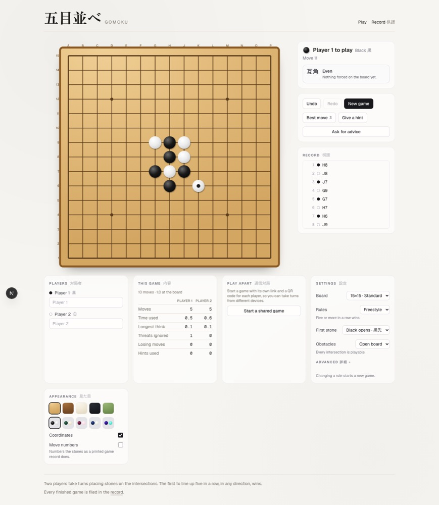

</div>

---

## Contents

- [Getting started](#getting-started)
- [What it does](#what-it-does)
- [How it is put together](#how-it-is-put-together)
- [The API](#the-api)
- [Games played from two devices](#games-played-from-two-devices)
- [Embedding the board](#embedding-the-board)
- [Scripts](#scripts)

## Getting started

```bash
pnpm install
cp .env.example .env      # points at the local database below
pnpm local:db:up          # disposable Postgres in Docker
pnpm db:deploy            # apply migrations
pnpm dev                  # http://localhost:6600
```

`WEB_PORT` overrides the port. `pnpm local:db:reset` throws the database away
and rebuilds it from the migrations.

## What it does

### Seven ways to play

Every game here is a line of stones at heart. The **Games** button opens a
browser over the board with each rule set spelled out, and picking one starts
a new game with those rules.

| Game | What changes |
| --- | --- |
| **Freestyle** 自由 | Five or more wins. Choose who opens, or draw lots. Line length 4, 5 or 6. |
| **Standard** 五目 | Exactly five wins; an overline (長連) does not. Black opens. |
| **Renju** 連珠 | Black may not make a double three (三三), double four (四四) or overline. White may, and white's overline wins. Forbidden points are marked ✕ and cannot be played. |
| **Omok** 오목 | The double three is forbidden for both sides. Overlines win. |
| **Caro** Cờ ca-rô | Exactly five wins, and not if an enemy stone shuts it in at both ends. |
| **Ninuki-renju** 二抜き連珠 | Flank a pair of enemy stones to capture it. Five in a row wins, and so does capturing five pairs. |
| **Connect6** 六子棋 | Black opens with one stone, then two stones a turn. Six in a row wins. |

Each is a row of data in `VARIANT_SPECS` — the line rule per colour, the
shapes each colour is forbidden, whether stones capture, stones per turn, a
pinned line length, and which openings it offers. The engine reads the spec and
never switches on a variant's name, so adding a game is adding a row and its
copy.

**Renju's forbidden points need reading ahead.** A *three* only counts if the
point that would turn it into an open four is itself a legal move, which means
asking the same question one stone deeper. `src/lib/gomoku/rules/forbidden.ts`
does that recursion (bounded, erring towards forbidding), counts a straight
four as one four rather than two, and lets a five through even when the same
stone makes a forbidden shape. The analysis and the hints filter through it,
so black is never advised to play a point black may not play.

### Openings

An opening only shapes the first stones, to blunt black's first-move advantage.

| Opening | Rule |
| --- | --- |
| **Free** | Anywhere. |
| **Pro** / **Long Pro** | Black opens at tengen; black's second stone must leave the central 5×5 (7×7). |
| **Swap** | Player 1 places black, white, black; Player 2 picks a colour. |
| **Swap2** | As Swap, or Player 2 adds white and black and hands the choice back. The World Championship rule. |
| **RIF** | Renju's classic start: tengen, then inside the 3×3, then inside the 5×5, after which white may swap. |

A swap opening pauses the game for a decision, and the decision is a timeline
entry like a move, so it can be taken back. Stored games keep the moves and
the decisions, not the seating, so a record replays under the free opening —
the stones are the same wherever the rules said they had to go. Shared games
between two devices start with the free opening, because a seat token is a
colour and a swap would move the colour between devices.

### Handicaps

A handicap gives one colour the rules of a harder game while the other plays
the plain one, so a stronger player can give a weaker one a fair fight. Every
toggle is a restriction some variant already imposes on a colour:

| Toggle | Borrowed from |
| --- | --- |
| No double three 三三禁 | Renju, Omok |
| No double four 四四禁 | Renju |
| No overline 長連禁 (six never wins, and may not be made) | Renju |
| Exactly five 五連限定 | Standard, Renju |
| Open line only 両端開放 | Caro |
| One more in a row 六連 | A traditional gomoku handicap |
| One stone a turn 一手一子 | Connect6 |
| No captures 取り無し | Ninuki-renju |
| Second stone outside the central 5×5 or 7×7 | Pro, Long Pro |

Under the hood every rule the engine consults — line rule, forbidden shapes,
captures, stones per turn, line length, opening exclusion — is read through one
function, `rulesFor(settings, colour)`, which lays the handicap over the
variant's spec for that colour. A handicap can only tighten, never loosen. It
belongs to a colour, so the openings and swaps that move colours between seats
are switched off while one is set.

### The review

When a game ends, a review (感想戦) appears beside the statistics. It replays
the game under every other rule set with the same shape of turn and line and
reports where they would have parted: a stone Renju or Omok would have
forbidden, a winning overline Standard would not have counted, a five Caro
would have called shut in, a pair Ninuki-renju would have captured, or a game
another rule set would already have ended. It also says whether the winner
gave the game away along the route and still won, and — for named players —
where the result sits in their run of recorded wins.

### The board

Nine, thirteen, fifteen or nineteen lines. The 9×9 mini board keeps five in a
row, so a game finishes in a few minutes rather than half an hour. In freestyle
you choose who opens — black, white, or a draw of the lots (振り駒); the formal
rule sets keep black on move one, so that control disables itself.

Star blocks (星塞ぎ) seal the hoshi points and leave tengen open, which turns
the middle of the board into a fight over one intersection.

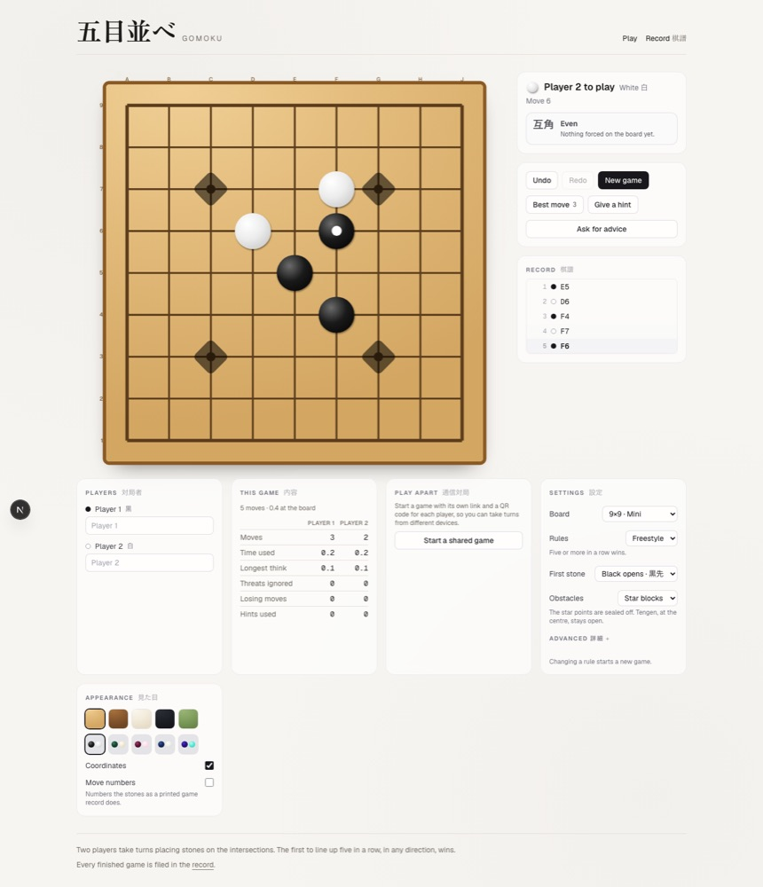

### It tells you what you are walking into

Awareness is a lens on the position, never a rule. Turning it off changes what
you are told and nothing about what is legal — the engine never reads it.

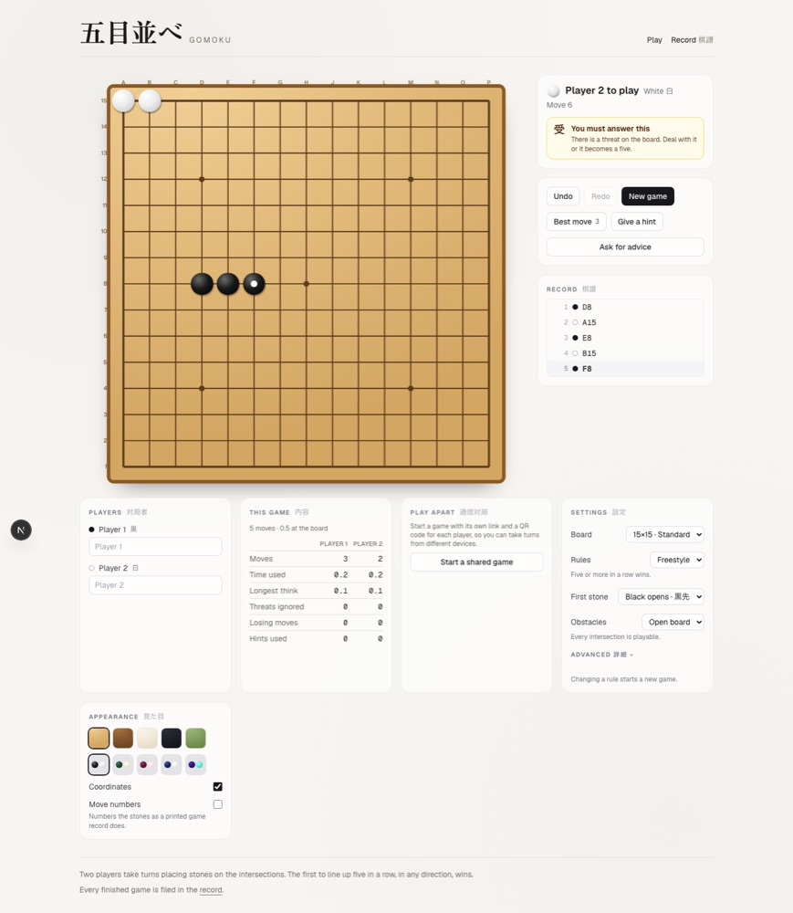

There are two different warnings, and the difference matters:

| | When it fires | What it means |
| --- | --- | --- |
| **受 Answer this** | A threat is already on the board | Block it this move or lose |
| **予兆 Something is forming** | The opponent could *build* an open three next move | Nothing is forced yet |

The second is one ply earlier than the first, and it is **off by default**. It
hands the defender a move they would otherwise have had to see coming, so it is
opt-in — and when it is on, both players get it on the same terms.

**敗着 — the losing move.** When a game becomes unwinnable, the record marks the
move that threw it away. That is rarely the move that just landed: ignoring an
open three is the mistake, but nothing is unstoppable until the open four
arrives, by which point the *opponent* is moving. So the blunder is attributed
to the losing side's last stone.

The reading is shallow on purpose. It sees immediate wins, unanswerable fours,
and the combined threats that follow from them, but it does not search. So
`lost` is reserved for positions one stone genuinely cannot save. Everything
short of that says *answer this*, not *it is over*.

### Clocks, odds and how the game went

Byoyomi (秒読み), the way professional go and renju are played: a main time,
then a number of short periods. Finish a move inside a period and you get the
whole period back, so a player in byoyomi can play forever as long as every
move is quick enough.

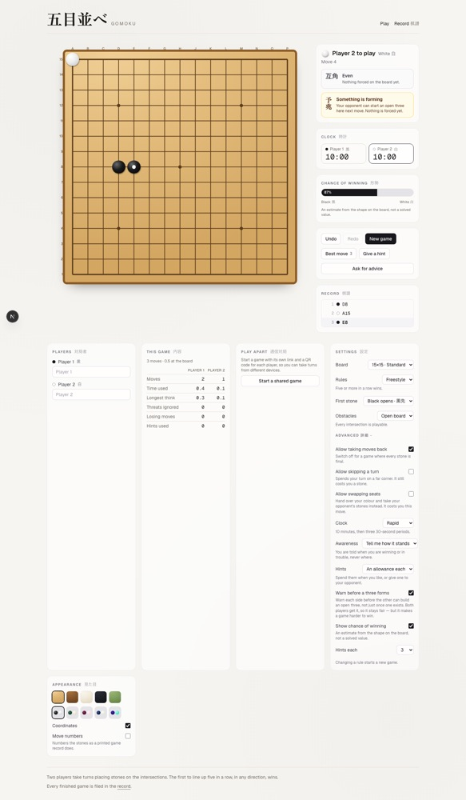

| Preset | Main time | Byoyomi |
| --- | --- | --- |
| Blitz 早碁 | 3 min | 3 × 10s |
| Rapid 速碁 | 10 min | 3 × 30s |
| Classical 持ち時間 | 30 min | 5 × 60s |

The chance-of-winning bar is an estimate from threats and shape, and is
labelled as one. The engine does not search, so it is a feel for the position
rather than a fact about it.

Afterwards, what actually happened — including two narrow, countable mistake
measures: **threats ignored** (you moved while the position was already
forcing and did not answer) and **losing moves** (you made a win unstoppable).

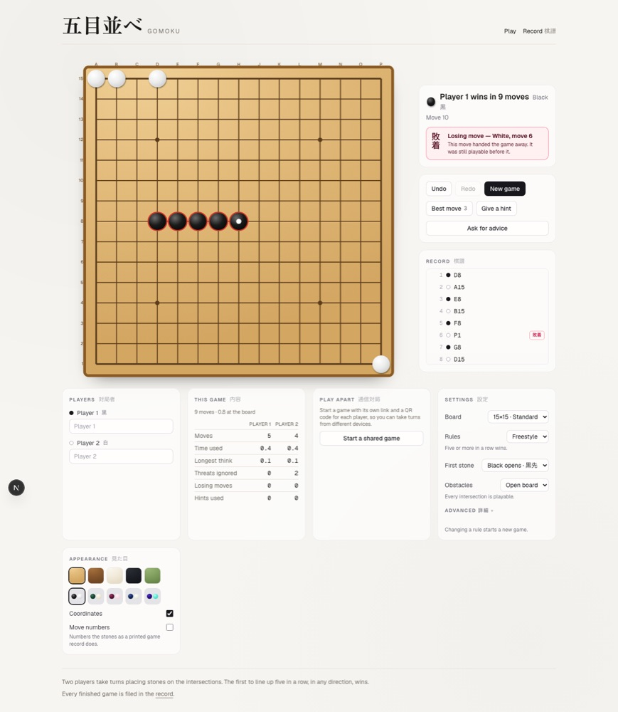

### Hints, gifts and asking for advice

The engine will name a best move, on an allowance you can also **give to your
opponent** — a gift of a hint being a rather better way to be generous than
taking a move back. Or ask your opponent directly: they mark the point they
would play, and you decide what to do about it.

### It looks like a board

Five surfaces — kaya, shin-kaya, washi, sumi, matcha — and five stone sets.

<p>
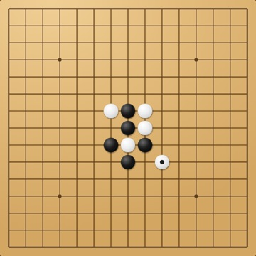
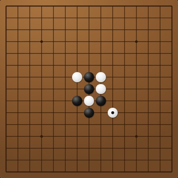
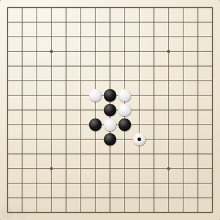
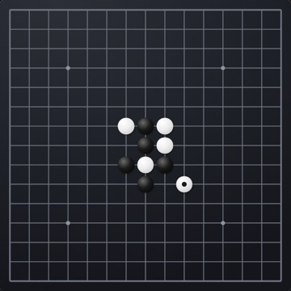
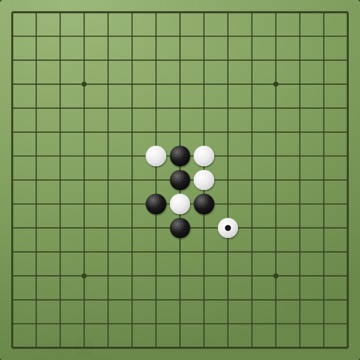
</p>

Coordinates and move numbers can be turned on, so a finished game reads like a
printed record.

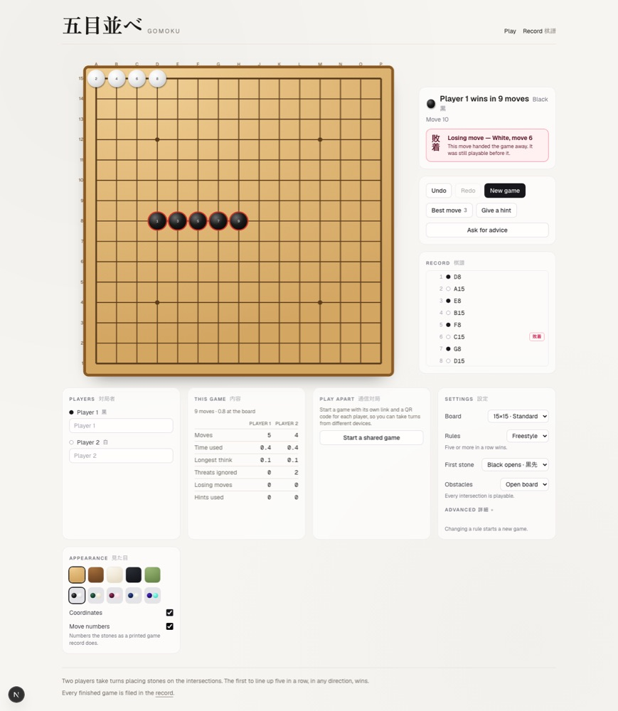

### Nothing is lost

A game in progress lives in local storage, so a refresh, a closed tab or a
flat battery all resume where you were — including the undo history. Every
finished game is filed in the record and can be replayed stone by stone.

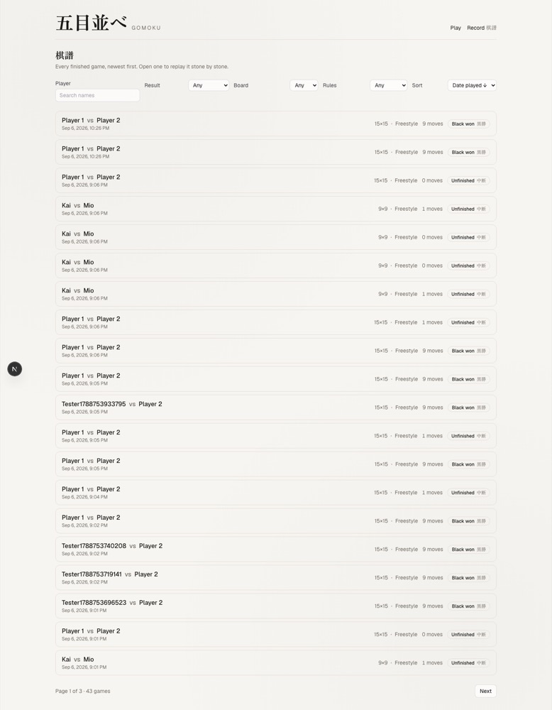

## How it is put together

The rules live in `src/lib/gomoku/engine.ts` and nowhere else. Every function
takes a `GameState` and returns a new one, so the same engine runs the board in
your browser, replays a stored game, and validates moves on the server. There
is no second implementation of "who has won".

A stored game is **a move list, never a board**. A board and a move list can
disagree; a move list replayed through the engine cannot.

| Directory | What lives there |
| --- | --- |
| `src/lib/gomoku/` | Engine, threat analysis, win estimate, notation, replay. Pure, no React. |
| `src/lib/gomoku/rules/` | The variant rules the engine consults: lines, forbidden shapes, captures, turns, openings. |
| `src/lib/clock/` | Byoyomi clocks. Pure, and driven by the wall clock rather than tick counts. |
| `src/lib/history/` | Reading and writing game history. |
| `src/components/board/` | The board and its themes. |
| `src/components/game/` | The local game, its session, settings and record. |
| `src/components/live/` | Games played from two devices. |
| `src/app/api/` | The HTTP API. |
| `e2e/` | Playwright specs, including the screenshot spec. |

## The API

Listing endpoints answer `{ pagination, items }`, with `pagination` carrying
`page`, `pageSize`, `total` and `totalPages`. `page` is clamped against the real
total rather than rejected, so narrowing a filter never strands you on an empty
page. Ordering always ends with `id`, so paging cannot hide a row.

| Method | Path | What it does |
| --- | --- | --- |
| `GET` | `/api/games` | List games. Paging, sorting, search, filters, facets. |
| `POST` | `/api/games` | Record a finished game with its moves. |
| `POST` | `/api/games/live` | Start a game for two devices. Returns a token per seat. |
| `GET` | `/api/games/:id` | One game with every move. |
| `DELETE` | `/api/games/:id` | Remove a game and its moves. Operator only: `Authorization: Bearer $ADMIN_TOKEN`. Disabled when `ADMIN_TOKEN` is unset. |
| `GET` | `/api/games/:id/moves` | That game's moves, paged. |
| `POST` | `/api/games/:id/moves` | Play a stone in a shared game. |
| `PUT` | `/api/games/:id/settings` | Change a shared game's rules before its first stone. Needs a seat token. |
| `GET` | `/api/players?q=` | Player-name autocomplete. |

`GET /api/games` accepts `page`, `pageSize`, `sortBy`
(`playedAt`/`moveCount`/`size`/`duration`), `sortDir`, `search`, `player`,
`result`, `variant`, `size`, `from` and `to`. Everything is validated with Zod
at the route boundary; an unknown sort column is a `400`, an unrecordable game
is a `422` listing what was wrong.

```bash
curl 'localhost:6600/api/games?search=aki&result=black&sortBy=moveCount&sortDir=asc&pageSize=5'
```

## Games played from two devices

`POST /api/games/live` returns `blackToken` and `whiteToken`. There is no
sign-in, so **a seat token is the seat**: whoever opens `/g/:id?p=<token>` plays
that colour. `/g/:id` without a token is a spectator view, and it is never shown
the seat links.

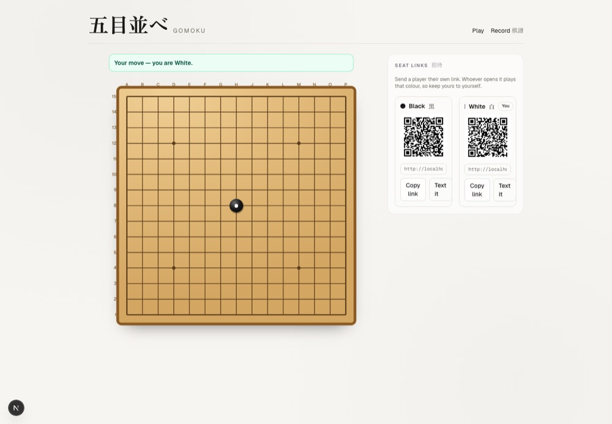

Each seat gets a QR code and an `sms:` link, so a seat can be handed over
without any messaging infrastructure — no gateway, no stored phone numbers.

Every move is re-validated on the server: whose turn it is, whether the point
is free, whether the game is still running. The unique index on
`(gameId, number)` is the concurrency control, so two devices racing to play the
same move number cannot both succeed.

Seat pages carry `robots: noindex`, because a seat link is a credential.

### Inside a site that has its own sign-in

Seat tokens exist because this app has no accounts. A host that does have them
should map its own identities to seats and stop passing tokens in the query
string — `seatForToken` in `src/lib/history/liveGame.ts` is the single place
that decides which seat a request holds.

## Embedding the board

Use an iframe against `/embed`. It isolates CSS, JavaScript and React versions
completely, needs no shared build, and nothing the host sends can change the
rules.

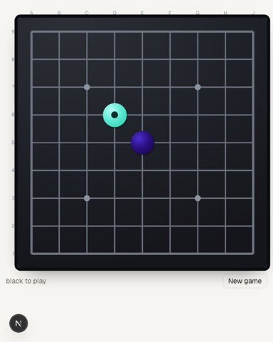

```html
<iframe src="https://your-host/embed?size=9&theme=sumi&stones=neon"
        style="border:0;width:100%;height:640px" title="Gomoku"></iframe>
```

Parameters: `size` (9/13/15/19), `variant` (`freestyle`, `standard`, `renju`,
`omok`, `caro`, `ninuki`, `connect6`), `opening` (`free`, `pro`, `longPro`,
`swap`, `swap2`, `rif`), `obstacles`, `theme`, `stones`, `coords=0`. Unknown values fall back rather than erroring — a host should not
be able to break the board by mistyping a parameter.

The board posts messages outward — `gomoku:ready`, `gomoku:resize`,
`gomoku:move`, `gomoku:result` — so a host can size the frame and react to play:

```js
window.addEventListener("message", (event) => {
  if (event.data?.type === "gomoku:resize") frame.style.height = `${event.data.height}px`;
});
```

Framing is refused unless the host origin is listed in `EMBED_ALLOWED_ORIGINS`
(space-separated). Every route other than `/embed` refuses framing outright.

If you want deeper integration than an iframe, `src/lib/gomoku/` is a pure
TypeScript module with no React or database dependency and can be imported
directly.

<br clear="right">

## Deploying

Production runs on Vercel with a Neon Postgres, the same shape as umakuma. A
push to `main` runs `.github/workflows/vercel-deploy.yml`: quality checks, the
dependency audit, a build, then `prisma migrate deploy` against the production
database, then the deploy. Migrations run before the new code goes live and
are all additive, so the old code keeps working during the switch.

One-time setup:

1. Create a Neon project and copy both connection strings: the pooled one is
   `DATABASE_URL`, the direct one is `DIRECT_URL`.
2. Create the Vercel project (`npx vercel link` from the repo, or the
   dashboard) and set `DATABASE_URL`, `DIRECT_URL`, an `ADMIN_TOKEN` for the
   delete endpoint and, if the board is to be embedded anywhere,
   `EMBED_ALLOWED_ORIGINS` in its production environment.
3. Add `VERCEL_TOKEN`, `VERCEL_ORG_ID` and `VERCEL_PROJECT_ID` as GitHub
   Actions secrets. The two IDs are in `.vercel/project.json` after linking.
4. Push to `main`.

`pnpm preflight:prod` runs the same checks the workflow does, locally.
`pnpm db:drift:check` compares the committed schema with whatever
`DATABASE_URL` points at and prints the SQL it is missing.

## Scripts

| Task | Command |
| --- | --- |
| Dev server (port 6600) | `pnpm dev` |
| Lint / fix | `pnpm lint` / `pnpm lint:fix` |
| Typecheck | `pnpm typecheck` |
| Unit tests | `pnpm test:unit` |
| End-to-end tests | `pnpm test:e2e` |
| Screenshots into `screenshots/` | `pnpm screenshots` |
| Rebuild `favicon.ico` from `icon.svg` | `pnpm favicon` |
| All gates | `pnpm quality:check` |
| Local database | `pnpm local:db:up` / `:down` / `:reset` |
| Migrations | `pnpm db:migrate` (dev) / `pnpm db:deploy` |

`pnpm quality:check` runs lint, the 500-line file size gate, typecheck and the
unit tests. See `AGENTS.md` for the conventions those gates enforce.

### What the record does not keep

The database stores a game's variant, size, obstacles and moves. It does not
store the opening protocol or a handicap, so a stored game replays under the
free opening with no handicap. For openings that changes nothing on the board.
For a handicap it can: a game one colour had to win with six replays as a game
it won with five. Keeping those needs two columns and a migration.
