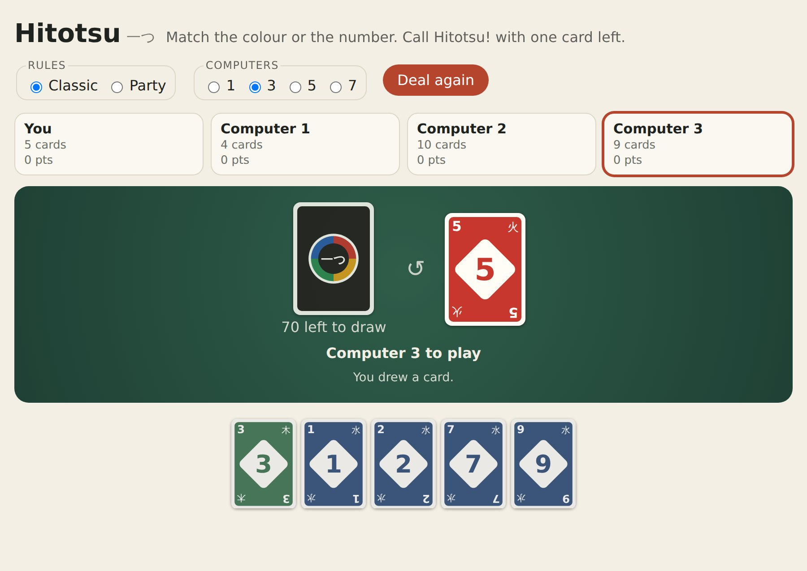
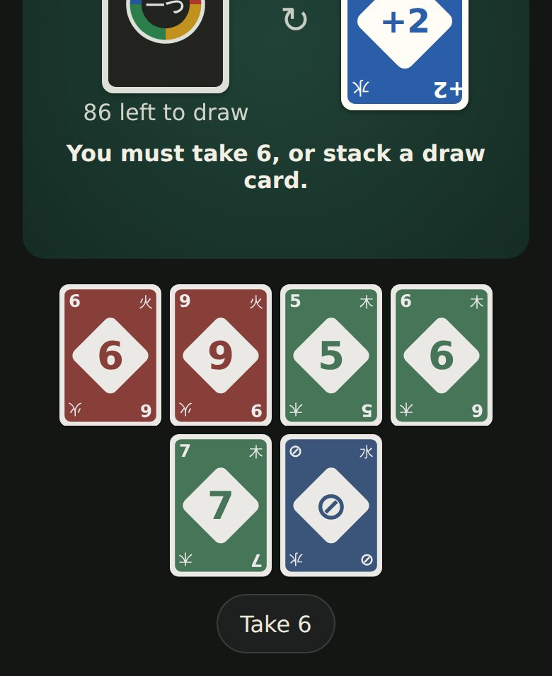

<h1 align="center">Hitotsu <sub>一つ</sub></h1>

<p align="center"><strong>The colour-card game, with the house rules people actually play.</strong><br>
Match the colour or the number, and call Hitotsu! with one card left. Two to eight players, a computer for any seat, a table for several devices, and a deck of its own.</p>

<p align="center">
  <a href="https://github.com/johnmorrisdotca/hitotsu/actions/workflows/ci.yml"></a>
  <a href="https://www.npmjs.com/package/@johnmorrisdotca/hitotsu"></a>
  <a href="./LICENSE"></a>
  
  
</p>

<p align="center"><a href="https://johnmorrisdotca.github.io/hitotsu/"><strong>Play a hand →</strong></a></p>

<p align="center">
  
  
</p>

*Hitotsu* means "one" in Japanese: the call a player makes with one card
left. It began as the colour-card game on [Itsutsu](https://itsutsu.com/games/hitotsu),
a site for board and table games, which uses this package for its rules, its
computer player, its tables on several devices and its cards.

## Features

- **The familiar game.** Numbers in four colours, Skip, Reverse, Draw Two,
  Wild and Wild Draw Four; the call with one card left, and two cards for
  forgetting it. Scored by the cards left in the other hands, to 200 or 500
  points, or a single hand.
- **The house rules, as options.** Stacking draw cards (the same card, or any
  on any), jump-in, sevens and zeros, draw until you can play, and the Wild
  Draw Four challenged or played without bluffing. `HITOTSU_CLASSIC` and
  `HITOTSU_PARTY` are ready-made; mix your own.
- **Pure and replayable.** Every function takes a game and returns a new one.
  A game is its set-up, a seed and its moves, kept as one line of text and read
  back by playing the moves again through the rules, so a saved game can never
  hold a position the rules would not reach.
- **A computer player** that stacks rather than takes, challenges a big hand's
  Wild Draw Four, saves its wilds, never bluffs and always calls. It sees only
  what a player at the table could.
- **Ready for several devices.** `readTableSetUp`, `startTable` and
  `readTableMove` check what arrives over the wire, and jumping in, a race no
  server can referee fairly, is taken off.
- **A deck of its own**, drawn as SVG: each colour carries one of the five
  elements in its corners (火 fire, 土 earth, 木 wood, 水 water), so no card is
  told by colour alone.
- **A table for any page**, in plain DOM, and React components for the table
  and the cards. Light and dark, and themeable.

<p align="center"></p>

## Install

```sh
npm install @johnmorrisdotca/hitotsu
```

ES modules with TypeScript types. The core and the table have no
dependencies; the React components need React 18 or later.

## Quick start

### A table on any page

```html
<div id="table"></div>
<script type="module">
  import { HITOTSU_PARTY, mountHitotsu } from "@johnmorrisdotca/hitotsu";

  mountHitotsu(document.getElementById("table"), {
    players: ["You", "Aki", "Ben", "Cy"],   // seat 0 is you, the rest computers
    rules: HITOTSU_PARTY,
    onMove: (game) => console.log(game.news),
  });
</script>
```

### In React

```tsx
import { HITOTSU_CLASSIC } from "@johnmorrisdotca/hitotsu";
import { HitotsuCardImage, HitotsuTable } from "@johnmorrisdotca/hitotsu/react";

export function Table() {
  return <HitotsuTable rules={{ ...HITOTSU_CLASSIC, stacking: "any" }} size={500} />;
}

export const RedFive = () => <HitotsuCardImage card="R50" width={80} />;
```

`HitotsuTable` mounts in the browser after the first render, so server
rendering draws an empty box and nothing needs a provider.

### Just the rules

```ts
import { HITOTSU_PARTY, hitotsuComputer, hitotsuMoves, hitotsuWinners, playHitotsu, startHitotsu } from "@johnmorrisdotca/hitotsu";

let game = startHitotsu(1, ["Ann", "Ben", "Cy"], 42, HITOTSU_PARTY)!; // one hand, seed 42
hitotsuMoves(game);                  // every legal move for the player to move
game = playHitotsu(game, { draw: true })!;   // null for a move the rules refuse
while (game.phase === "playing") game = playHitotsu(game, hitotsuComputer(game))!;
hitotsuWinners(game);                // [1]
```

## The rules

| Rule | Classic | Party | Option |
| --- | --- | --- | --- |
| Cards dealt | 7 | 5 | `deal: 7 \| 5` |
| Stacking draw cards | off | any on any | `stacking: "off" \| "same" \| "any"` |
| Jump-in (an identical card, out of turn) | off | on | `jumpIn` |
| Sevens and zeros (a 7 swaps hands, a 0 passes every hand on) | off | on | `sevenZero` |
| Drawing | one card | one card | `drawToMatch` |
| Wild Draw Four | may be challenged | may be challenged | `wildFour: "challenge" \| "strict"` |

The length is separate: `startHitotsu(size, …)` with 200 or 500 points, or 1
for a single hand. A card left in a hand scores its number, an action card 20
and a wild 50. A hand nobody can finish, with the stock and pile spent and
everybody passing, goes to whoever holds the fewest points.

A card is a short name: its colour (`R`, `Y`, `G`, `B`, or `W` for a wild),
its face (a digit, `S` skip, `R` reverse, `D` draw two, `W` wild, `F` wild draw
four) and which copy it is. The two red fives are `R50` and `R51`.

## API

Every function is pure, and every type is exported.

### Playing

```ts
startHitotsu(size, players, seed?, options?, computers?): HitotsuGame | null
hitotsuMoves(game): HitotsuMove[]          // the player to move's legal moves
hitotsuJumpIns(game): HitotsuMove[]        // cards other seats may jump in with
playHitotsu(game, move): HitotsuGame | null
hitotsuWinners(game): number[]
hitotsuTop(game), hitotsuPlayable(game), hitotsuMatches(game, card)

type HitotsuMove =
  | { play: HitotsuCard; colour?: HitotsuColour; swap?: number; call?: boolean }
  | { draw: true } | { pass: true } | { take: true } | { challenge: true }
  | { jump: HitotsuCard; seat: number; colour?: HitotsuColour; swap?: number; call?: boolean };
```

### One seat's view

```ts
movesFor(game, seat)            // its turn's moves, or its jump-ins at another's turn
playableFor(game, seat)         // the cards it may put down now
callMatters(game, seat)         // whether calling Hitotsu! is a choice now
waysFor(game, seat, card, call) // each way that card may go down
quickMove(game, seat, card, call) // the one way, or null if there is a colour or a seat to choose
```

### The computer

```ts
hitotsuComputer(game): HitotsuMove           // for the player to move
hitotsuComputerJump(game): HitotsuMove | null // a computer seat jumping in
```

### Keeping a game, and tables on several devices

```ts
encodeHitotsu(game): string
decodeHitotsu(text): HitotsuGame | null      // replays every move through the rules
readHitotsuOptions(sent), readHitotsuMove(sent)

readTableSetUp(sent): { seed, options } | null   // jumping in taken off
startTable(size, count, sent, computers?): HitotsuGame | null
readTableMove(sent): HitotsuMove | null          // never a jump
tableToPlay(game), tableComputerMove(game, seat), namedTable(game, names)
```

### The deck and its design

```ts
HITOTSU_DECK, shuffledHitotsu(seed, hand), sortHitotsu(hand)
colourOf(card), faceOf(card), isWild(card), hitotsuPoints(card), hitotsuWords(card)

hitotsuCardSvg(card | null, { width?, called?, title? }): string
hitotsuCardShapes(card | null, called?): HitotsuShape[]
HITOTSU_COLOUR_LOOK, HITOTSU_FACE_MARK
```

`hitotsuCardShapes` is the design, once: `hitotsuCardSvg`, the table and the
React `HitotsuCardDrawing` all draw it.

### The table

```ts
mountHitotsu(element, {
  players?, rules?, size?, seed?,
  computerMs?,       // how long a computer thinks: your window to jump in
  strings?,          // your own words
  theme?,            // CSS variables, such as { "--ht-felt": "#234" }
  onMove?,
}): { game(), restart(options?), destroy() }
```

## Theming

Every colour is a CSS variable on `.ht-root`: `--ht-surface`, `--ht-ink`,
`--ht-muted`, `--ht-rule`, `--ht-felt`, `--ht-felt-deep`, `--ht-felt-ink`,
`--ht-accent`, `--ht-accent-ink`, `--ht-playable`, `--ht-radius`, `--ht-card`
and `--ht-font`. Pass them as `theme`, or set them on any ancestor.

## Roadmap

- More house rules: seven-card Draw, No Mercy's bigger draw cards, and
  forced play
- A second computer player that counts cards
- Sound, and a deal animation
- The table in Japanese

Ideas and pull requests are welcome.

## Contributing

See [CONTRIBUTING.md](./CONTRIBUTING.md). In short:

```sh
npm install
npm run check   # types and tests
npm run site    # build the demo into ./site, then serve it
```

Please follow the [code of conduct](./CODE_OF_CONDUCT.md).

## Changes

See [CHANGELOG.md](./CHANGELOG.md).

## Licence

[MIT](./LICENSE) © John Morris
